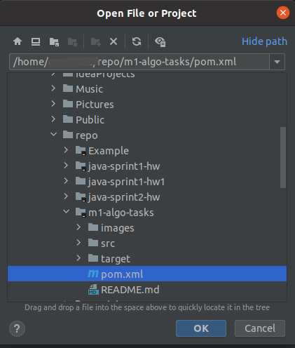
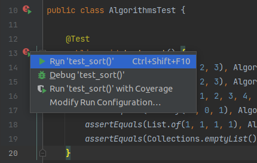
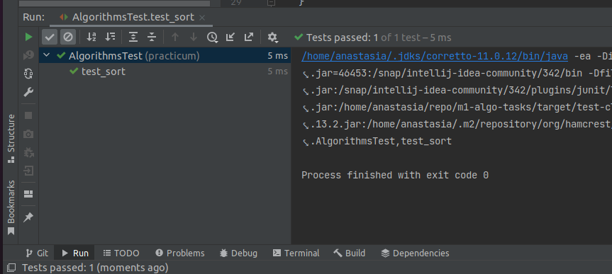
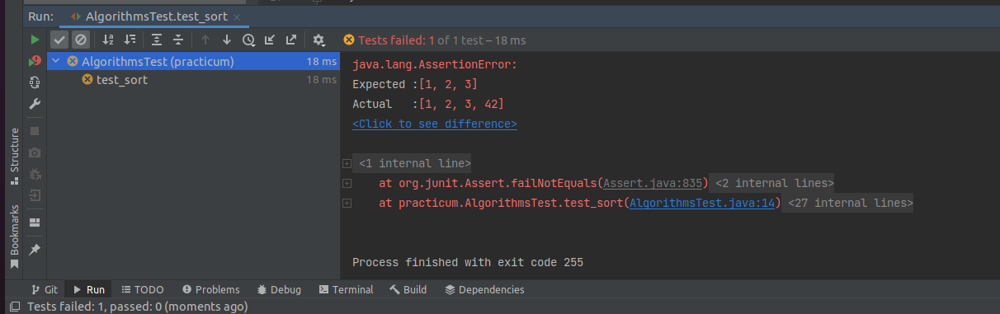

# m1-algo-tasks

Привет! В этом репозитории хранится набор дополнительных задачек на алгоритмы и структуры данных.
Приступайте к ним, если вы сделали основное задание спринта.
Нужно выполнить следующие действия:
1. Склонировать этот репозиторий.
2. Написать код. Условия задач написаны в виде комментариев в классе `Algorithms`.
3. Проверить корректность своего кода с помощью тестов.

**Важное условие**: из тестов в методы передаются списки, которые нельзя изменять. Это значит, что вам нужно написать код таким образом, чтобы он не менял список, полученный в качестве аргумента. Такой подход, когда метод не изменяет аргументы, считается хорошей практикой.

## Как открыть проект в IDEA

После того, как вы склонировали репозиторий, откройте IDEA.
В IDEA нажмите меню `File → Open`. Выберите файл `pom.xml`, который находится в склонированном репозитории:

## Тестирование кода

Для каждого задания в проекте написаны тесты. Они хранятся в классе `AlgorithmsTest`. С помощью тестов можно проверить, правильно ли вы реализовали тот или иной алгоритм. Название теста соответствует названию метода в классе `Algorithms` с префиксом `test_`. Например, для метода `sort` проверка корректности будет выполнятся в методе `test_sort`.

Пока вам не нужно уметь самостоятельно реализовывать тесты, достаточно просто уметь их запускать.
Для того, чтобы это сделать, нужно перейти в класс `AlgorithmsTest` и нажать зелёный треугольник возле метода с нужным названием. Тесты можно запускать в режиме исполнения или в режиме отладки:

Если после запуска тесты загорелись зелёным -- ура, вы справились!

Если тест падает, то сообщение будет выглядеть вот так:

В строке `Expected` написан ожидаемый результат, а в `Actual` фактический.
В данном примере после выполнения метода `sort` должен был вернуться список `[1, 2, 3]`,
а вернулся `[1, 2, 3, 42]`.
Для того, чтобы найти ошибку в своём коде, запустите тест в режиме отладки (`Debug`).
Не забудьте поставить *breakpoint*-ы внутри нужного метода.

Можно запустить сразу все тесты. Для этого нужно нажать кнопку запуска не возле конкретного тестового метода, а возле имени класса `AlgorithmsTest`.

Удачи!
